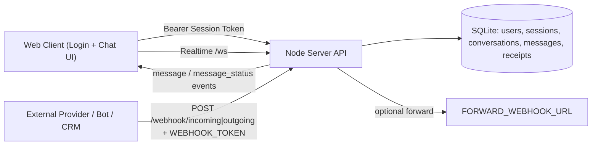

# Demo Brief

## POC Goal
Build a multi-user realtime messaging system that supports:
- account-based login
- per-user conversation access control
- realtime message delivery + read receipts
- external webhook ingestion for integration paths

## What Works Today
- Auth: `register/login/logout/me/status`
- Conversations: list + open direct chat
- Messages: send/read/history with cursor pagination
- Realtime: WebSocket (`/ws`) + SSE fallback (`/stream`)
- Security: user can only access conversations they belong to
- Persistence: SQLite relational schema (`users/sessions/conversations/messages/receipts`)

## Current Technology Used
- Runtime: Node.js (http server)
- Realtime: WebSocket (`ws`) + SSE fallback
- DB: SQLite (`better-sqlite3`)
- Frontend: Vanilla HTML/CSS/JS
- Tunnel for public demo: Cloudflare Tunnel or ngrok

## Architecture


## Key APIs (Demo)
- `POST /auth/register`
- `POST /auth/login`
- `GET /conversations`
- `POST /messages`
- `GET /messages?conversationId=<id>&limit=20&before=<cursor>`
- `POST /messages/:id/read`
- `POST /webhook/incoming` and `POST /webhook/outgoing`

## How to Show Webhook Path with WEBHOOK_TOKEN
1. Start app with webhook protection:
```bash
WEBHOOK_TOKEN=shared-secret npm start
```
2. Demonstrate unauthorized request fails:
```bash
curl -i -X POST http://localhost:8080/webhook/incoming \
  -H 'Content-Type: application/json' \
  -d '{"from":"ext-system","to":"alice","text":"hello from webhook"}'
```
3. Demonstrate authorized request succeeds:
```bash
curl -i -X POST http://localhost:8080/webhook/incoming \
  -H 'Authorization: Bearer shared-secret' \
  -H 'Content-Type: application/json' \
  -d '{"from":"ext-system","to":"alice","text":"hello from webhook"}'
```
4. Show message appears in chat/realtime stream for relevant user.

## Integration Extension Story (Talk Track)
- Current webhook endpoint accepts normalized external events.
- Next extension:
  - verify provider signatures (Twilio/Meta/etc.)
  - map provider payload -> internal message schema
  - persist and broadcast to active user sessions
  - optional forwarding to analytics/CRM via `FORWARD_WEBHOOK_URL`
- Result: same core messaging pipeline works for app messages + external channels.

## Demo Talking Points (2-3 min)
1. “This POC proves end-to-end multi-user messaging with realtime delivery and read receipts.”
2. “Auth and conversation membership are enforced server-side; unauthorized conversation access is blocked.”
3. “History scales via cursor pagination, and realtime is resilient via websocket + fallback sync.”
4. “Webhook path is production-aligned: token-gated today, signature verification next.”
5. “Architecture is ready for extensions: group chats, media, provider adapters, observability.”

## Current Limitations (Honest)
- Basic password model (no MFA/OAuth yet)
- Direct chats only in UI (no group UI yet)
- Minimal ops telemetry

## Next 3 Improvements
1. OAuth + refresh tokens + secure cookie sessions.
2. Group conversations and member management APIs.
3. Provider signature validation + delivery retry/queue.
